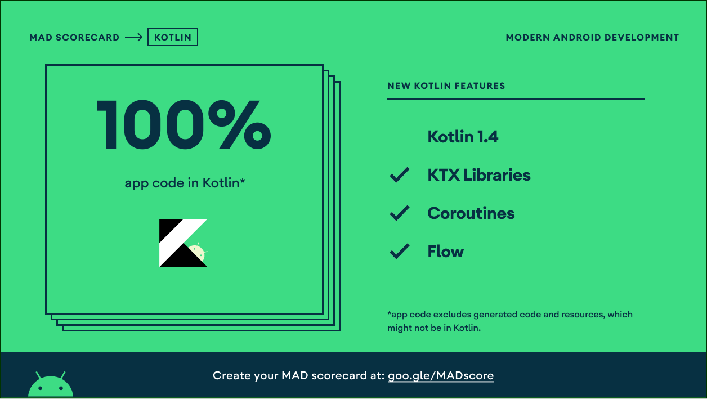

# GitHubSearch
A GitHub Search Android apps using MVVM, Modularization, Clean Architecture, Dagger 2, Coroutine Flow, Coil, Airbnb Epoxy, and Unit Test.
There are 2 features on this apps:
1. Search GitHub users by name.
2. Get detail information of the user including Profile and Repository with load more features.

Note: You can also check the implementation Dagger 2 and RxJava in **dagger2-rxjava** branch (on going).

## 💡 Stack and Libraries
* [Kotlin](https://https://kotlinlang.org/) - built with 100% Kotlin.
* [Coroutines Flow](https://github.com/alvayonara/OpenWeatherApps#:~:text=with%20100%25%20Kotlin.-,Coroutines%20Flow,-%2D%20emit%20multiple%20values) - emit multiple values sequentially (flatMap, zip, etc.)
* [Jetpack Components](https://developer.android.com/jetpack/)
  - Navigation
  - ViewModel
  - Material Components
  - ViewBinding
  - KTX
* [Kotlin Gradle DSL](https://docs.gradle.org/current/userguide/kotlin_dsl.html): Gradle's Kotlin DSL provides an alternative syntax to the traditional Groovy DSL with an enhanced editing experience in supported IDEs, with superior content assist, refactoring, documentation, and more.
* [Dagger 2](https://dagger.dev/) - dependency injection.
* [Clean Architecture](https://blog.cleancoder.com/uncle-bob/2012/08/13/the-clean-architecture.html) - separates code into layers.
* [Modularization](https://developer.android.com/guide/app-bundle/play-feature-delivery/) - separating logical components of project into discrete modules.
* [Epoxy](https://github.com/airbnb/epoxy) - library for building complex screens in a RecyclerView.
* [Moshi](https://github.com/square/moshi) - modern JSON library.
* [Retrofit2](https://github.com/square/retrofit/) - REST APIs.
* [Coil](https://github.com/coil-kt/coil) - Image loading for Android backed by Kotlin Coroutines..
* [Chucker](https://github.com/ChuckerTeam/chucker/) - an HTTP inspector.
* [MockK](https://mockk.io/) - mocking unit testing.
* [Timber](https://github.com/JakeWharton/timber/) - logger.

## 💎 Architecture
This apps uses Clean Architecture to separate code into layers (Data - Domain - Presentation).

## 💎 MAD Scorecard

